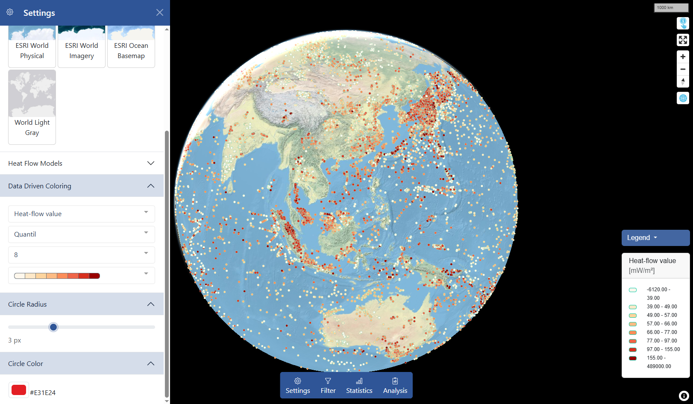

<!-- inspiration for readme https://www.freecodecamp.org/news/how-to-write-a-good-readme-file/ -->


# Global Heat Flow Database - Web Map Application

The [Global Heat Flow Database - Web Map Application](https://portal.heatflow.world/explore/) was developed as part of the World Heat Flow Database Project. Its primary objective is to provide easy, browser-based access to the Global Heat Flow Database with minimal user effort. This application allows users to quickly explore heat flow data without the need to download or import it into a GIS.

**Key Features:**
- Instant Access: View the Global Heat Flow Database directly in the browser.
- Interactive Visualization: Provides an intuitive and interactive mapping interface to explore heat flow data.
- User-Friendly Interface: Built with a low barrier to entry, enabling users of all technical levels to explore global heat flow data effortlessly.

**Technical Overview:**
The application is developed using the Vue.js JavaScript framework and leverages a range of well-established libraries, including:

- MapLibre for interactive mapping
- Pinia for internal state managment
- Plotly for data visualization
- Bootstrap for responsive UI components

And many others to provide a seamless and rich user experience.

The web application includes a variety of tools to explore and analyze the heat flow data, making it an essential resource for researchers and practitioners in geophysics and related fields.



Full technical documntation can be found [here](https://heatflowworld.readthedocs.io/en/latest/guides/map_exploration/index.html)

<!-- https://docs.github.com/en/repositories/managing-your-repositorys-settings-and-features/customizing-your-repository/about-readmes -->


## Setup Web Map Application on your local machine

#### Clone repo

```sh
git clone https://github.com/ihfc-iugg/HeatFlowMapping.git
cd HeatFlowMapping/
```

#### Install depending packages

```sh
npm install
```

#### Compile and Hot-Reload for Development

```sh
npm run dev
```

#### Compile and Minify for Production

```sh
npm run build
```

#### Run Unit Tests with [Vitest](https://vitest.dev/)

```sh
npm run test:unit
```

#### Run End-to-End Tests with [Cypress](https://www.cypress.io/)

```sh
npm run test:e2e:dev
```

This runs the end-to-end tests against the Vite development server.
It is much faster than the production build.

But it's still recommended to test the production build with `test:e2e` before deploying (e.g. in CI environments):

```sh
npm run build
npm run test:e2e
```

#### Lint with [ESLint](https://eslint.org/)

```sh
npm run lint
```

#### Compiles and minifies for production
```
npm run build
# run app local
serve -s dist
```

## Credits

## License

<!-- ## Migration from VueCLI to Vite
[How to Migrate from Vue CLI to Vite](https://vueschool.io/articles/vuejs-tutorials/how-to-migrate-from-vue-cli-to-vite/) -->

<!-- ### Publish new package to npm
[How to Publish a Package on npm](https://www.makeuseof.com/npm-publish-package-how/)

### Update package version number
[Updating your published package version number](https://docs.npmjs.com/updating-your-published-package-version-number)

### Unpublish package
[npm Unpublish Policy](https://docs.npmjs.com/policies/unpublish) -->
